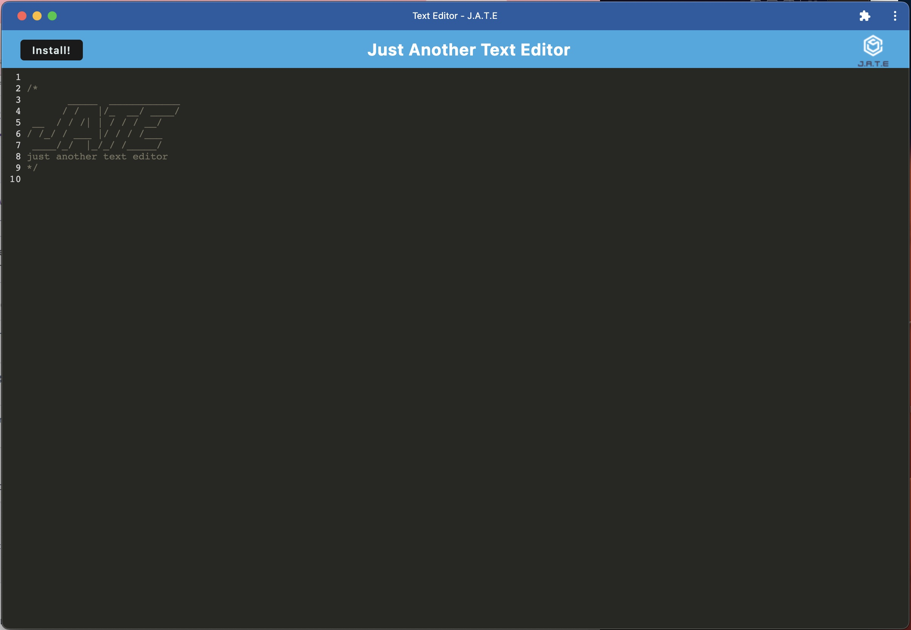

# Browser Text Editor

## Description

    A text editor that runs in a browser.

## Table of Contents

- [License](#license)
- [Screenshot](#screenshot)
- [Links](#links)
- [Questions](#questions)

## License

None

## Screenshot

## Links

- [GitHub Repository](https://github.com/lizbeth-thurm/browser-text-editor)

- [Deployed Application](https://browser-text-editor-2023.herokuapp.com/)

## Questions

GitHub Username:

- [lizbeth-thurm](https://github.com/lizbeth-thurm)

- You can reach me with any questions at [my email address](mailto:slthurman01@gmail.com)
